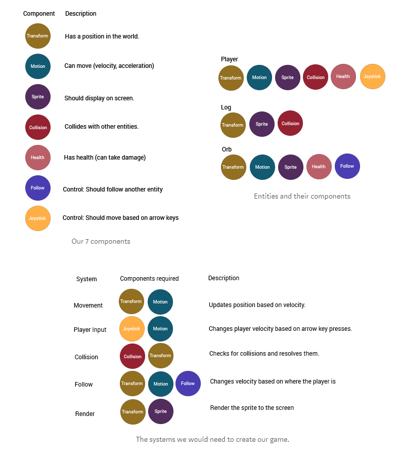
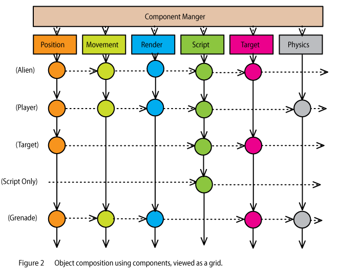
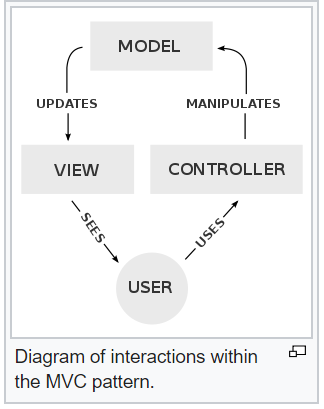

## ECS - Entity-Component System

Summary
 - composition over inheritance
 - change behavior on runtime by adding/removing components to entities
   - eliminates copmlex inheritance hierarchy

from [Wiki][1]:
 > Martin's terminology
 > 
 > - **Entity**: general purpose object, usually only consists of a unique id: Integer.
 > - **Component**: the raw data for one aspect of the object, and how it interacts with the world: Structs, Classes, or Associative Arrays
 > - **System**: runs continuously and performs global actions on every Entity that possesses a Component of the same aspect as that System.

Systems iterate over their component list and perform the logic <- better data locality and L1 usage. 

Component and Entity are only data and no functions.

### Examples

#### Niko Savas: Nomad Game Engine: Part 2 — ECS [image source][3]

#### Mick West: Evolve Your Hierarchy [image source][4]

## MVC - Model-View-Controller

Summary
 - commonly used for UI

from [Wiki][2]

 > 
 > 
 > - **Model**: The Data Structure: It directly manages the data, logic and rules of the application.
 > - **View**: Any output representation of information. 
 > - **Controller**: Accepts input and converts it to commands for the model or view
 >
 > ### Advantages & disadvantages
 > #### Advantages
 > 
 > - Simultaneous development – Multiple developers can work simultaneously on the model, controller and views.
 > - High cohesion – MVC enables logical grouping of related actions on a controller  together. The views for a specific model are also grouped together.
 > - Low coupling – The very nature of the MVC framework is such that there is low  coupling among models, views or controllers
 > - Ease of modification – Because of the separation of responsibilities, future development or modification is easier
 > - Multiple views for a model – Models can have multiple views
 >
 > #### Disadvantages
 > - Code navigability – The framework navigation can be complex because it introduces  new layers of abstraction and requires users to adapt to the decomposition criteria  of MVC.
 > - Multi-artifact consistency – Decomposing a feature into three artifacts causes scattering. Thus, requiring developers to maintain the consistency of multiple representations at once.
 > - Pronounced learning curve – Knowledge on multiple technologies becomes the norm. > Developers using MVC need to be skilled in multiple technologies.

# References 

- [Wikipedia: ECS][1]
- [Wikipedia: MVC][2]

[1]: https://en.wikipedia.org/wiki/Entity%E2%80%93component%E2%80%93system
[2]: https://en.wikipedia.org/wiki/Model%E2%80%93view%E2%80%93controller
[3]: https://medium.com/@savas/nomad-game-engine-part-2-ecs-9132829188e5
[4]: http://cowboyprogramming.com/2007/01/05/evolve-your-heirachy