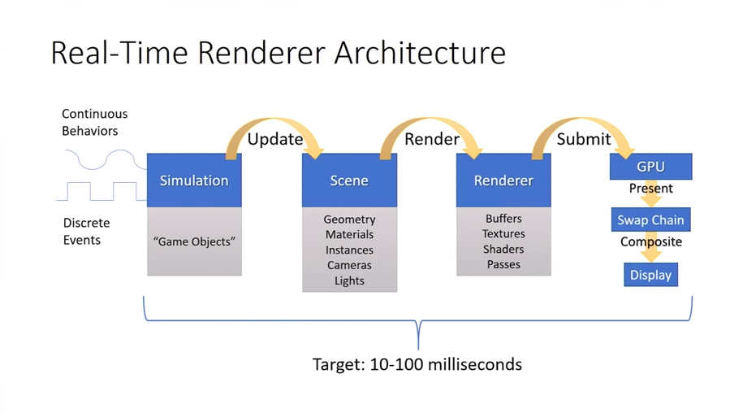
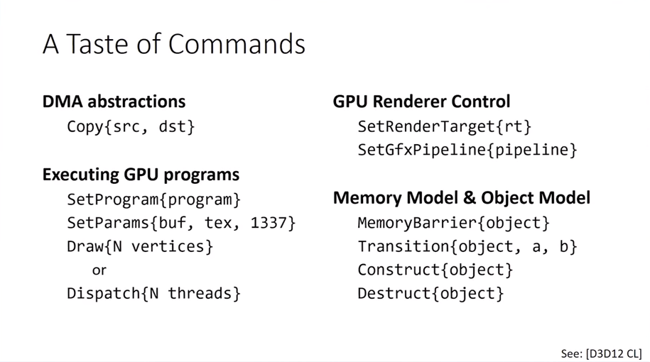
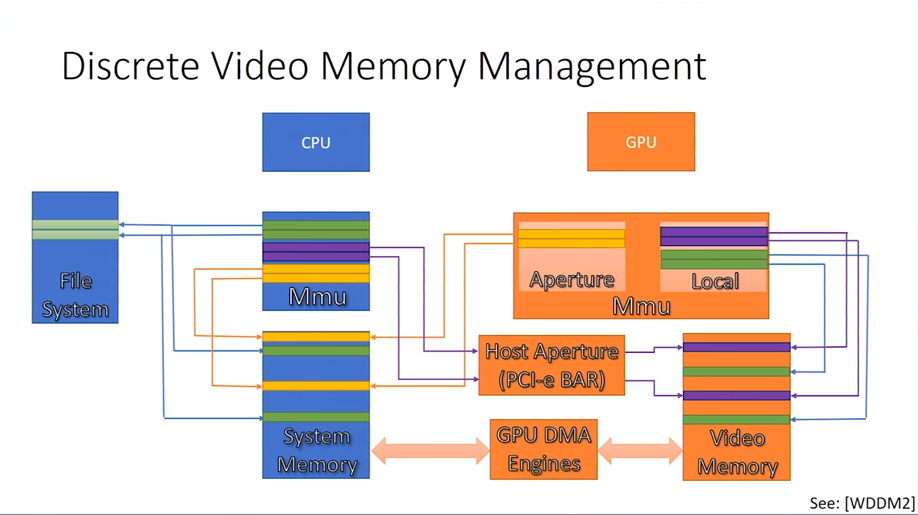
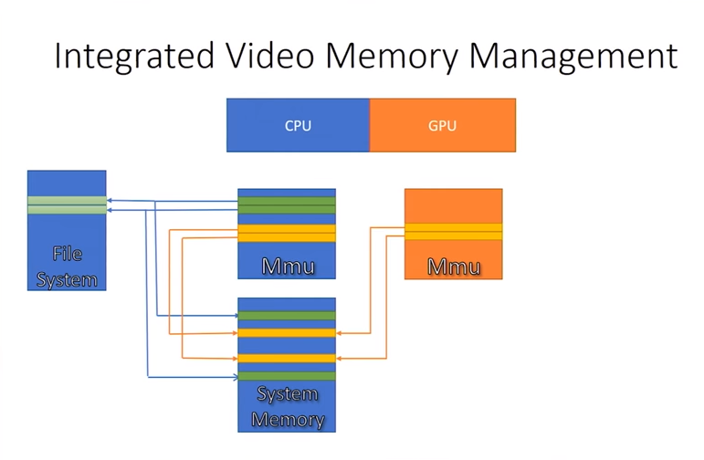

# VQEngine Documentation

This page is Currently to serve as a collection of resources that influenced the engine/renderer design.

# Engine Design

Below is the collection of resources used for building the VQEngine. Items marked with star\* are implemented in the codebase.

## Conference Talks & YouTube Content

- [CppCon2017: Nicolas Guillemot “Design Patterns for Low-Level Real-Time Rendering”](https://www.youtube.com/watch?v=mdPeXJ0eiGc)
- [GCAP 2016: Parallel Game Engine Design - Brooke Hodgman](https://www.youtube.com/watch?v=JpmK0zu4Mts)
- [CppCon 2016: Jason Jurecka “Game engine using STD C++ 11"](https://www.youtube.com/watch?v=8AjRD6mU96s)
- [C++Now 2018: Allan Deutsch "Game Engine API Design"](https://www.youtube.com/watch?v=W3ViIBnTTKA)
- [CppCon 2014: Mike Acton "Data-Oriented Design and C++"](https://www.youtube.com/watch?v=rX0ItVEVjHc)
- [Jonathan Blow: Data-Oriented Demo: SOA, composition](https://www.youtube.com/watch?v=ZHqFrNyLlpA)
- [Code Blacksmith: Thread Pool Tutorial](https://www.youtube.com/watch?v=eWTGtp3HXiw)

## Text

- [Game Programming Patterns](http://gameprogrammingpatterns.com/contents.html)
  - [Data Locality](http://gameprogrammingpatterns.com/data-locality.html)
  - [Object Pool](http://gameprogrammingpatterns.com/object-pool.html)

# Rendering

## Shadows

- [Docs MS: Common Techniques to Improve Shadow Depth Maps](https://docs.microsoft.com/en-us/windows/desktop/dxtecharts/common-techniques-to-improve-shadow-depth-maps)

## BRDF

- [**Joe DeVayo: LearnOpenGL - PBR Theory\***](https://learnopengl.com/#!PBR/Theory)
- [PBS Physics Math Notes](http://blog.selfshadow.com/publications/s2012-shading-course/hoffman/s2012_pbs_physics_math_notes.pdf)
- [Trowbridge-Reitz GGX Distribution - How NDF is defined](http://reedbeta.com/blog/hows-the-ndf-really-defined/)
- [Fresnel-Schliick w/ roughness](https://seblagarde.wordpress.com/2011/08/17/hello-world/)

## Environment Mapping
 - [**Joe DeVayo: LearnOpenGL - Image-Based Lighting I: Diffuse Irradiance\***](https://learnopengl.com/PBR/IBL/Diffuse-irradiance)
 - [**Joe DeVayo: LearnOpenGL - Image-Based Lighting II: Specular IBL\***](https://learnopengl.com/PBR/IBL/Specular-IBL)

## Depth Buffer
  - [NVidia - Depth Precision Visualized](https://developer.nvidia.com/content/depth-precision-visualized)
  - [The Devil In The Details: Linear Depth](http://dev.theomader.com/linear-depth/)
  - [Robert Dunlop: Linearized Depth using Vertex Shaders](https://www.mvps.org/directx/articles/linear_z/linearz.htm)
  - [Emil "Humus" Persson: A couple of notes about Z](http://www.humus.name/index.php?ID=255)
  - [MJP: Reconstructing Position From Depth](https://mynameismjp.wordpress.com/2009/03/10/reconstructing-position-from-depth/)
  - [David Lenaerts: Reconstruction Positions From the Depth Buffer](http://www.derschmale.com/2014/01/26/reconstructing-positions-from-the-depth-buffer/)

## Math
- [gamedev StackExchange QA: Cylindrical Projection UV Coordinates](https://gamedev.stackexchange.com/questions/114412/how-to-get-uv-coordinates-for-sphere-cylindrical-projection)
- [Paul Bourke: Converting to/from Cube Maps](http://paulbourke.net/miscellaneous/cubemaps/)
- [Holger Dammertz - Hammersley Points on the Hemisphere](http://holger.dammertz.org/stuff/notes_HammersleyOnHemisphere.html )
- [Scratchapixel: Introduction to Quasi Monte Carlo](https://www.scratchapixel.com/lessons/mathematics-physics-for-computer-graphics/monte-carlo-methods-in-practice/monte-carlo-methods)

# Optimizations

## View Frustum Culling
 - [Universitat Bremen CGVR: View Frustum Culling Tutorial OpenGL](http://cgvr.informatik.uni-bremen.de/teaching/cg_literatur/lighthouse3d_view_frustum_culling/index.html)
 - [**Fast Extraction of Viewing Frustum Planes from the WorldView-Projection Matrix\***](http://gamedevs.org/uploads/fast-extraction-viewing-frustum-planes-from-world-view-projection-matrix.pdf)
 - [Fabian Giesen: View frustum culling (2010)](https://fgiesen.wordpress.com/2010/10/17/view-frustum-culling/)
 - [**Zeux: View frustum culling optimization\***](https://zeuxcg.org/2009/03/01/view-frustum-culling-optimization-never-let-me-branch/)
 
## Occlusion Culling
- [GPU Gems - Chaper 29: Efficient Occlusion Culling](http://developer.download.nvidia.com/books/HTML/gpugems/gpugems_ch29.html)
- [Gamasutra: Occlusion Culling Algorithms](https://www.gamasutra.com/view/feature/131801/occlusion_culling_algorithms.php?page=1)
- [Intel: Software Occlusion Culling](https://software.intel.com/en-us/articles/software-occlusion-culling)
  - Setup a software rasterizer for depth buffer
  - Render the set of 'occluders' into depth buffer
  - Test all the 'occludees' aginst depth buffer
  - SSE/AVX for optimization
- [Fabian Giesen: Optimizing Software Occlusion Culling](https://fgiesen.wordpress.com/2013/02/17/optimizing-sw-occlusion-culling-index/)
 - [Masked Software Occlusion Culling](https://software.intel.com/sites/default/files/managed/ef/61/masked-software-occlusion-culling.pdf)
   - Iteration of previous [Intel: Software Occlusion Culling](https://software.intel.com/en-us/articles/software-occlusion-culling)
  - [Nick Darnell: DirectX11 Hi-Z Occlusion Culling](https://www.nickdarnell.com/hierarchical-z-buffer-occlusion-culling/)

 ## Shadow View Culling
 - [Umbra 2011: Shadow Caster Culling for Efficient Shadow Mapping](http://dcgi.felk.cvut.cz/?media=publications%2F2011%2Fbittner-i3d-scc%2Fpaper.pdf&alias=Bittner2011&action=fetch&presenter=Media)
 - [Stefan-S: Shadow caster frustum culling](http://stefan-s.net/?p=92)

# VQEngine Architecture

VQEngine architecture is more or less based on [Nicolas Guillemot's CppCon2017 Talk:  “Design Patterns for Low-Level Real-Time Rendering”](https://www.youtube.com/watch?v=mdPeXJ0eiGc).

## Misc Figures

