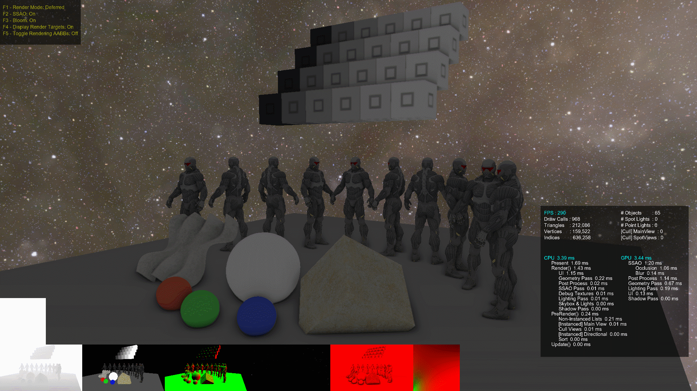

# VQEngine - A DirectX11 & C++11 Real-Time Renderer

 A DirectX 11 rendering framework for stuyding and practicing various rendering techniques and real-time algorithms. 

Quick Look:

 - [Renderer.h](https://github.com/vilbeyli/VQEngine/blob/master/Source/Renderer/Renderer.h)
 - [Scene.h](https://github.com/vilbeyli/VQEngine/blob/master/Source/Engine/Scene.h)
 - [Engine.h](https://github.com/vilbeyli/VQEngine/blob/master/Source/Engine/Engine.h)
 - [RenderPasses.h](https://github.com/vilbeyli/VQEngine/blob/master/Source/RenderPasses/RenderPasses.h)
 - [AmbientOcclusion.cpp](https://github.com/vilbeyli/VQEngine/blob/master/Source/RenderPasses/Source/AmbientOcclusionPass.cpp)

###### Model Loading (.obj), HDR, Bloom, Point Lights

###### PBR Pipeline, BRDF, Environment Lighting,  SSAO

###### Mesh LODs

###### Debug Rendering, CPU & GPU profiler, Frame Stats, Bounding Boxes

# Feature List / Version History

See [Milestones](https://github.com/vilbeyli/VQEngine/milestones) for the planned upcoming changes and [Releases page](https://github.com/vilbeyli/VQEngine/releases) for the version histroy.

## What's Next

The latest changes can be found in the [dev branch](https://github.com/vilbeyli/VQEngine/tree/dev), or another branch named with the feature being implemented. _These branches might be unstable before the release_.

**[v0.7.0](https://github.com/vilbeyli/VQEngine/releases/tag/v0.7.0) DirectX12 & Multi-threading - TBA 2019**

- TBA

## Released

**[v0.6.0](https://github.com/vilbeyli/VQEngine/releases/tag/v0.6.0) - Point Light Shadows, Improved Texture Support, Mesh LODs, Improved Perf** - TBA 2019

- Real-time Point Light Shadows (up to 5)
- [Mesh Level of Detail (LOD)](https://en.wikipedia.org/wiki/Level_of_detail#A_discrete_LOD_example) System
- RenderPass Abstraction (rough)
- PBR
  - Roughness, Metallic, Emissive texture support
  - Preset loading
- New Scenes 
  - Light Test Scene (#6)
  - LOD Test Scene (#7)
  - PBR Scene (#3)

**[v0.5.0](https://github.com/vilbeyli/VQEngine/releases/tag/v0.5.0) - CPU & GPU Optimizations, Compute Shaders** - October22-2018
 
 - Compute Shader Pipeline
 - Live Shader Editing (Launch Once - Edit Shader Source - Reload Shader)
 - Compute-Optimized Blur Shaders
 - View Frustum Culling
 - Instanced Rendering
 - Shader Permutations w/ Shader Binary Cache support 

 **[v0.4.0](https://github.com/vilbeyli/VQEngine/releases/tag/v0.4.0) - Data-Oriented Engine, Multi-threaded Tasking System, Model Importing, Loading Screen** - July15-2018
 - Refactored Scene, Engine and Renderer classes in favor of [Data-Oriented Design](https://en.wikipedia.org/wiki/Data-oriented_design)
 - Asynchronous Model Loading using [assimp](https://github.com/assimp/assimp)
 - [Sponza](http://www.crytek.com/cryengine/cryengine3/downloads) Scene & More Models
 - Task-based Threading System
 - Rendering: Directional Lights, Alpha Mask Textures
 - Loading Screen & Multi-threaded Scene Loading
 - App Icon
 - Documentation, Resource Collection & Wiki Pages

 **[v0.3.0](https://github.com/vilbeyli/VQEngine/releases/tag/v0.3.0) - Automated Build, Logging, Text Rendering, CPU & GPU Profiler** - May7-2018
 - Text Rendering
 - CPU & GPU Profiler
 - Shader Binary Cache
 - Build scripts (Python, Batch) & Automated Build (AppVeyor)
 - Logging: Console and/or Log Files

 **[v0.2.0](https://github.com/vilbeyli/VQEngine/releases/tag/v0.2.0) - PBR, Deferred Rendering & Scene Manager** - December1-2017
 - On-the-fly-switchable Forward/Deferred Rendering
 - PBR: GGX-Smith BRDF
 - Environment Mapping (Image-Based Lighting)
 - PCF Soft Shadows
 - Bloom
 - SSAO w/ Gaussian Blur
 - Custom Scene File Parsing
 - Scene Manager & Multiple Scenes

**[v0.1.0](https://github.com/vilbeyli/VQEngine/releases/tag/v0.1.0) -  Shader Reflection, Phong Lighting, Shadow Mapping & Texturing** - July15-2017
 - Vertex-Geometry-Pixel Shader Pipeline
 - Shader Reflection
 - Phong Lighting
 - Point Lights (No Shadows)
 - Spot Lights (Simpe Shadow Mapping)
 - Normal/Diffuse Maps
 - Procedural Geometry: Cube, Sphere, Cylinder, Grid
  
# Prerequisites

The projects are set to build with the following configurations:

 - [Windows 10 SDK](https://developer.microsoft.com/en-us/windows/downloads/windows-10-sdk) - 10.0.17134.0
 - Visual Studio 2017 - v141, v140
  
- **System**: Ryzen/GCN. VQEngine hasn't been tested on other systems. Feel free to [open an issue](https://github.com/vilbeyli/VQEngine/issues) in case of crashes / errors.

# Build

Run `PRE_BUILD.bat` once to initialize the submodules, and run `BUILD.bat` or `BUILD.py` to build VQEngine. `./Build/_artifacts` will contain the VQEngine executable built in release mode and the data and shaders needed to run the demo. You need Visual Studio 2017 installed for the build scripts to work.

| Scripts | |
| :-- | :-- |
| `PRE_BUILD.bat` | Initializes and updates submodules required to build the project. *Run this script the first time you clone the repo.* |
| `BUILD_CLEAN.bat` | Calls 'Clean Solution' on `VQEngine.sln` and deletes the contents of the Build folder. *Run this script before building VQEngine.* |
| `BUILD.bat` | Builds VQEngine. |
| `CONSOLIDATE_ARTIFACTS.bat` | Copies binaries and resources required to run VQEngine into `Build/_artifacts` folder. *Run this script after running `BUILD.bat`.* |
| `PRE_BUILD_CLEAN.bat` | Deletes contents of the submodule folders. |
| `CLEAN_SHADER_CACHE.bat` | Removes the `ShaderCache/` folder from VQEngines temporary directory: `%APPDATA%\VQEngine` |

# Controls

| Scene Controls |  |
| :---: | :--- |
| **WASD** |	Camera Movement |
| **R** | Reset Camera |
| **C** | Cycle Through Scene Cameras |
| **\\** | Reload Shaders (live shader editing) |
| **Shift+R** |	Reload Current Scene From File |
| **0-7** |	**Switch Scenes**:  **1**: Objects Scene  **2**: SSAO Test  **3**: Environment Map Test  **4**: Stress Test  **5**: Sponza Scene **6**: Lights Scene **7**: Mesh LOD Scene

| Engine Controls |  |
| :---: | :--- |
| **Page Up/Down** | Change Environment Map |
| **Ctrl + Shift + F** |	Toggle Displaying CPU/GPU Performance Numbers & Frame Stats |
| **Backspace** | Pause App |
| **ESC** |	Exit App |

| Renderer Controls | |
| :---: | :--- |
| **F1** |	Toggle Controls |
| **F2** |	Toggle Ambient Occlusion |
| **F3** |	Toggle Bloom |
| **F4** |	Toggle Display Render Targets |
| **F5** |  Toggle Bounding Box Rendering |
| **F6** |	Toggle Forward/Deferred Rendering |

# 3rd Party Open Source Libraries
 
 - [nothings/stb](https://github.com/nothings/stb)
 - [freetype-windows-binaries](https://github.com/ubawurinna/freetype-windows-binaries)
 - [DirectXTex](https://github.com/Microsoft/DirectXTex)
 - [assimp](https://github.com/assimp/assimp)