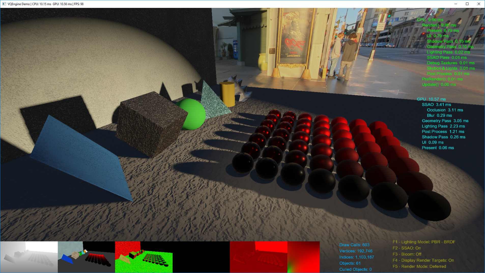
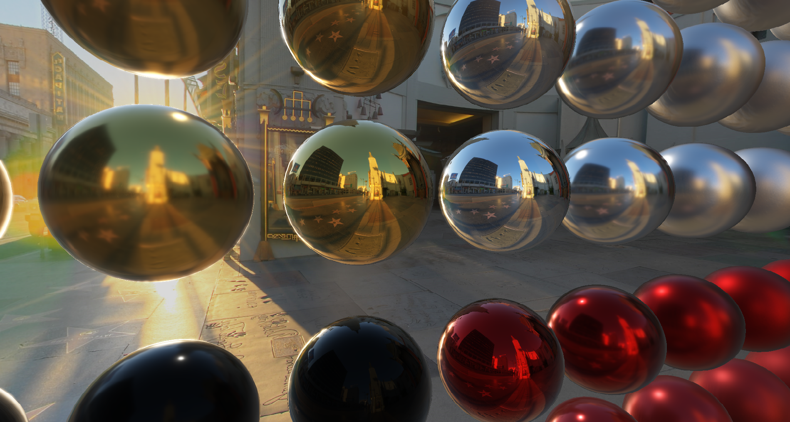

# VQEngine - A DirectX11 & C++11 Real-Time Renderer

A DirectX 11 rendering framework for stuyding and practicing various rendering techniques and real-time algorithms. 

###### PCF Shadows, CPU & GPU profiler, Text Rendering, Environment Lighting

###### BRDF, HDR, Tonemapping, Bloom, Environment Mapping - Image-based Lighting

###### SSAO w/ Gaussian Blur

# Feature List / Version History

 *v0.3.0 - Automated Build, Logging, Text Rendering, CPU & GPU Profiler - May7-2018*
 - Text Rendering
 - CPU & GPU Profiler
 - Shader Binary Cache
 - Build scripts (Python, Batch) & Automated Build (AppVeyor)
 - Logging: Console and/or Log Files

 *v0.2.0 - PBR, Deferred Rendering & Multiple Scenes - December1-2017*
 - On-the-fly-switchable Forward/Deferred Rendering
 - PBR: GGX-Smith BRDF
 - Environment Mapping (Image-Based Lighting)
 - PCF Soft Shadows
 - Bloom
 - SSAO w/ Gaussian Blur
 - Custom Scene Files, Switchable/Reloadable Scenes

*v0.1.0 - Simple Lighting, Texturing and Shader Reflection: July15-2017*
 - Vertex-Geometry-Pixel Shader Pipeline
 - Shader Reflection
 - Phong Lighting
 - Simple Shadow Maping Algorithm
 - Normal/Diffuse Maps
 - Procedural Geometry: Cube, Sphere, Cylinder, Grid
  

# Prerequisites

The projects are set to build with the following configurations:

 - [Windows 10 SDK](https://developer.microsoft.com/en-us/windows/downloads/windows-10-sdk): v10.0.16299.0
 - Visual Studio 2017 (v141)
 
- **GPU**: Radeon R9 380 equivalent or higher. Demo hasn't been tested on other systems. Feel free to [open an issue](https://github.com/vilbeyli/VQEngine/issues) in case of crashes / errors.

# Build

Run `BUILD.bat` or `BUILD.py` to build the project. `./Build/_artifacts` will contain the executable built in release mode and the data and shaders needed to run the demo. You need Visual Studio 2017 installed for the build scripts to work.

# How To Use

| Scene Controls |  |
| :---: | :--- |
| **WASD** |	Camera Movement |
| **R** | Reset Camera |
| **C** | Cycle Through Scene Cameras |
| **Shift+R** |	Reload Current Scene From File |
| **0-4** |	**Switch Scenes**:  **1**: Objects Scene  **2**: SSAO Test  **3**: Environment Map Test  **4**: Stress Test

| Engine Controls |  |
| :---: | :--- |
| **Page Up/Down** | Change Environment Map / Skybox |
| **;** |	Toggle Displaying CPU/GPU Performance Numbers |
| **'** |	Toggle Displaying Rendering Stats |
| **Shift + '** |	Toggle Displaying Renderer Controls |
| **Backspace** | Pause App |
| **ESC** |	Exit App |

| Renderer Controls | |
| :---: | :--- |
| **F1** |	Toggle Lighting Shaders (Phong/BRDF) |
| **F2** |	Toggle Ambient Occlusion |
| **F3** |	Toggle Bloom |
| **F4** |	Toggle Display Render Targets |
| **F5** |	Toggle Forward/Deferred Rendering |
| **\\** |  Reload Shaders |

# 3rd Party Open Source Libraries
 
 - [nothings/stb](https://github.com/nothings/stb)
 - [freetype-windows-binaries](https://github.com/ubawurinna/freetype-windows-binaries)
 - [DirectXTex](https://github.com/Microsoft/DirectXTex)
 - [assimp](https://github.com/assimp/assimp)