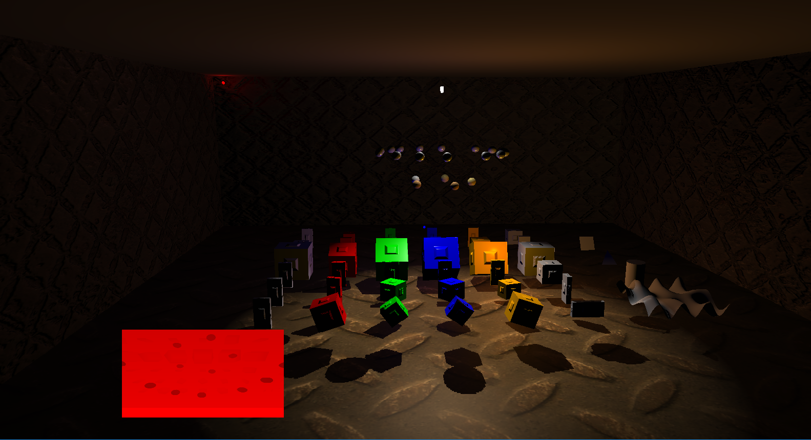

# DX11Renderer - VDemo

This project started as the Renderer module for my [3D-Animation project](https://www.youtube.com/watch?v=Rt-h-bMA8Xc) at [DigiPen Institute of Technology](https://www.digipen.edu/).
Now, this repo serves as a DX11 framework for stuyding and practicing various rendering techniques and real-time algorithms. 

## Milestones

See [all Milestones here](https://github.com/vilbeyli/DX11Renderer/milestones).
 
 ***Completed***

*v0.1 : July15-2017*
 - Vertex-Geometry-Pixel Shader Pipeline
 - Simple Shader Reflection
 - Phong Lighting
 - Simple Shadow Maps
 - Normal Maps
 - Diffuse Textures
 - Procedural Geometry: Cube, Sphere, Cylinder, Grid
 
 ***In Development***
 
 *v0.2*
 - BRDF
 - Bloom
 - Cubemap - skybox
 - Image-Based Lighting
 - Deferred Rendering
 - AO
 - Improved Shadow Map

## Compiling Instructions & Dependencies (to be automated)

Navigate to `Source\3rdParty\DirectXTex` and compile the solution `DirectXTex_Desktop_2015.sln` with the *platform settings that match that of this project's*. 
This will generate the lib file that is required to compile the DX11Renderer project.

 - The project uses [DirectXTex](https://github.com/Microsoft/DirectXTex) for textures. Current project settings
look for a `DirectXTex.lib` file in `3rdParty\DirectXTex\DirectXTex\Bin\Desktop_2015\$(Platform)\$(Configuration)`. 
You will get the following error message on build unless you have already copmiled the DirectXTex library:  
    > `2>LINK : fatal error LNK1104: cannot open file 'DirectXTex.lib'`

## Controls

| Key | Control |
| :---: | :--- |
| **WASD** |	Camera Movement |
| **numpad::468239** |	Shadow Caster Light Movement |
| **F1** |	TexCoord Shader |
| **F2** |	Normals Shader |
| **F3** |	Tangents Shader |
| **F4** |	Bitangents Shader |
| **F5** |	Unlit Shader |
| **F6** |	Phong Shader |
| **F7** |	Debug Shader |
| **F9** |	Toggle Gamma Correction |
| **Backspace** | Pause App |
| **ESC** |	Exit App |
 
