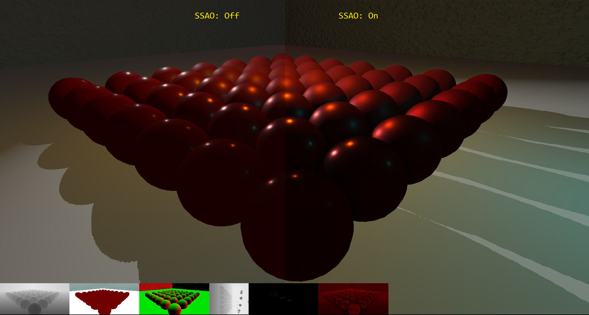
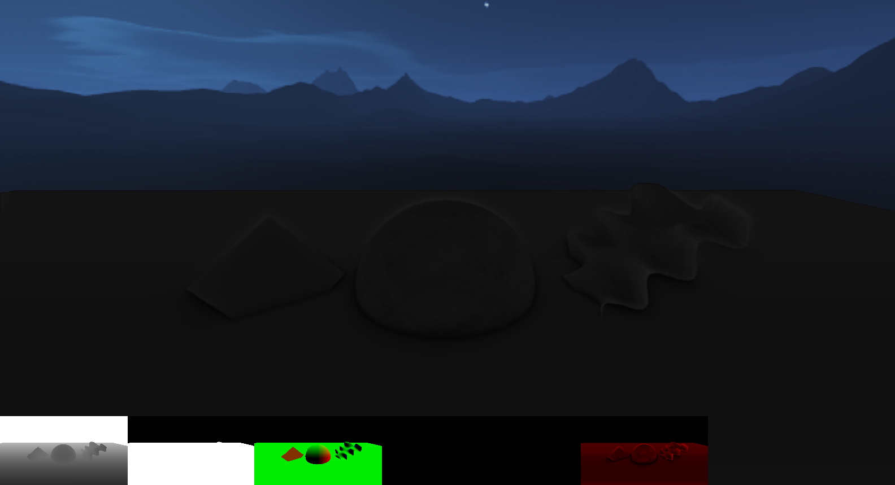

# DX11Renderer - VDemo | DirectX11 & C++11 Real-Time Renderer

A DirectX 11 rendering framework for stuyding and practicing various rendering techniques and real-time algorithms. 

<i>BRDF, HDR, Bloom</i>

<i>SSAO</i>

## Prerequisites

 - [Windows 10 SDK](https://developer.microsoft.com/en-us/windows/downloads/windows-10-sdk) - probably the latest version. Also latest Visual Studio.
  
   Note: if the linker throws the error `1>LINK : fatal error LNK1158: cannot run 'rc.exe'` do the following:
   - Copy `rc.exe` and `rcdll.dll` 
   from `C:\Program Files (x86)\Windows Kits\10\bin\10.0.15063.0\x64` to `C:\Program Files (x86)\Microsoft Visual Studio 14.0\VC\bin`

## Controls

| Key | Control |
| :---: | :--- |
| **WASD** |	Camera Movement |
| **numpad::468239** |	Shadow Caster Light Movement |
| **F1** |	TexCoord Shader (Forward Rendering Only) |
| **F2** |	Normals Shader (Forward Rendering Only) |
| **F3** |	Diffuse Color Shader (Forward Rendering Only) |
| **F4** |	Toggle TBN Shader (Forward Rendering Only) |
| **F5** |	Lighting Shader (Forward Rendering Only) |
| **F6** |	Toggle Phong/BRDF Shaders |
| **F7** |	Toggle Debug Shader |
| **F8** |	Toggle Forward/Deferred Rendering |
| **F9** |	Toggle Bloom |
| **;** |	Toggle Ambient Occlusion |
| **Backspace** | Pause App |
| **R** | Reset Camera |
| **\\** | Reload Shaders |
| **'** | Toggle Floor Normal Map |
| **ESC** |	Exit App |
 

## Milestones & Future

Future Plans / In-Development: https://github.com/vilbeyli/DX11Renderer/issues

See [active Milestones here](https://github.com/vilbeyli/DX11Renderer/milestones).
 
 ***Completed***

*v0.1 : July15-2017*
 - Vertex-Geometry-Pixel Shader Pipeline
 - Shader Reflection
 - Phong Lighting
 - Simple Shadow Maps
 - Normal Maps
 - Diffuse Textures
 - Procedural Geometry: Cube, Sphere, Cylinder, Grid
 
 ***In Development***
 
 *v0.2* - Expected: Early November
 - BRDF
 - Bloom
 - Cubemap Textures
 - Skybox
 - Image-Based Lighting
 - Deferred Rendering
 - SSAO
 - Improved Shadow Maps
 - Anti-Aliasing
 - Z-PrePass
 - Scene files
