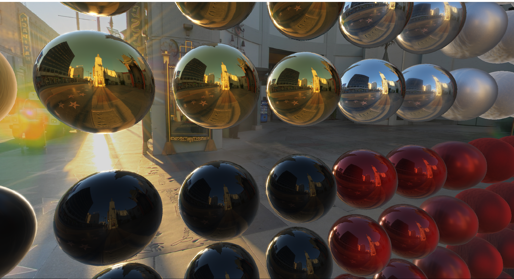
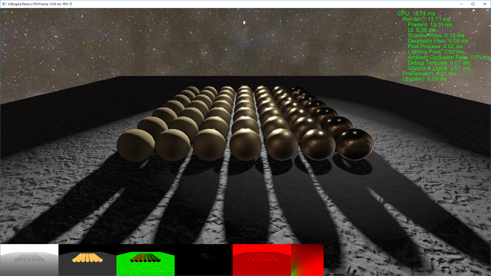
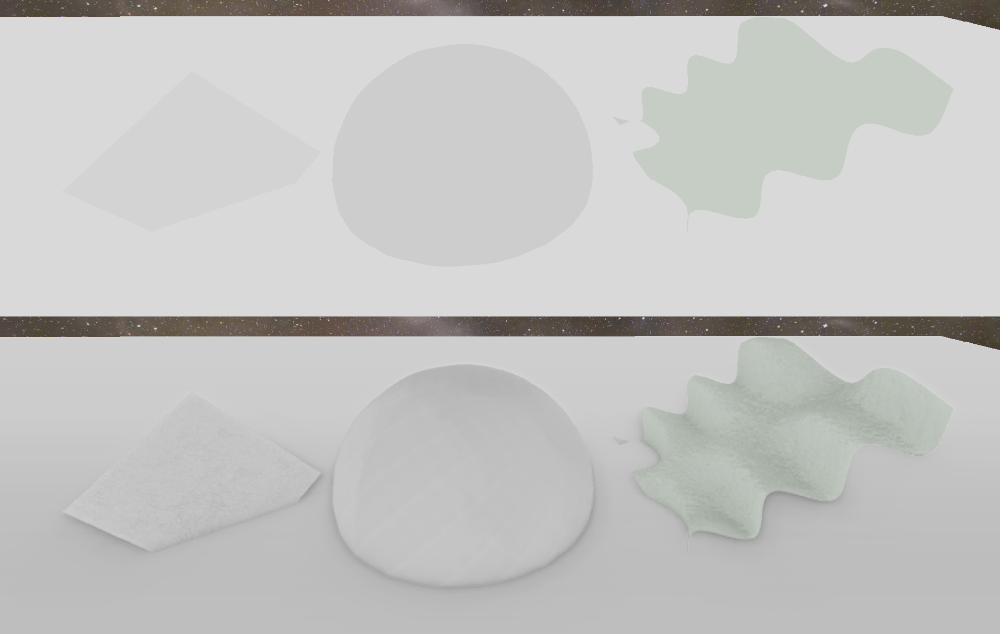

# VQEngine - A DirectX11 & C++11 Real-Time Renderer

A DirectX 11 rendering framework for stuyding and practicing various rendering techniques and real-time algorithms. 

<i>BRDF, HDR, Tonemapping, Bloom, Environment Mapping - Image-based Lighting</i>

# Feature List / Version History

 *v0.2.1 - Automated Build, Performance Logging, Text Rendering - TBA(March)*
 - Text Rendering
 - CPU Profiler
 - GPU Profiler (**WIP**)
 - Build scripts (Python, Batch) & Automated Build (AppVeyor)

 *v0.2.0 - PBR, Deferred Rendering & Multiple Scenes - December1-2017*
 - On-the-fly-switchable Forward/Deferred Rendering
 - PBR: GGX-Smith BRDF
 - Environment Mapping (Image-Based Lighting)
 - PCF Soft Shadows
 - Bloom
 - SSAO w/ Gaussian Blur
 - Custom Scene Files, Switchable/Reloadable Scenes

*v0.1.0 - Simple Lighting, Texturing and Shader Reflection: July15-2017*
 - Vertex-Geometry-Pixel Shader Pipeline
 - Shader Reflection
 - Phong Lighting
 - Simple Shadow Maping Algorithm
 - Normal/Diffuse Maps
 - Procedural Geometry: Cube, Sphere, Cylinder, Grid
  

<i>PCF Shadows, CPU profiler, Text Rendering</i>

<i>SSAO w/ Gaussian Blur</i>

# Prerequisites

 - [Windows 10 SDK](https://developer.microsoft.com/en-us/windows/downloads/windows-10-sdk) - probably the latest version. I'm using the latest Visual Studio 2017 version.
  
   Note: if the linker throws the error `1>LINK : fatal error LNK1158: cannot run 'rc.exe'` do the following:
   - Copy `rc.exe` and `rcdll.dll` 
   from `C:\Program Files (x86)\Windows Kits\10\bin\10.0.15063.0\x64` to `C:\Program Files (x86)\Microsoft Visual Studio 14.0\VC\bin` (or wherever you store Visual Studio)
 
- **GPU**: Radeon R9 380 equivalent or higher. Demo hasn't been tested on other systems. Feel free to [open an issue](https://github.com/vilbeyli/VQEngine/issues) in case of crashes / errors.

# Build

Run `BUILD.bat` or `BUILD.py` to build the project. `./Build/_artifacts` will contain the executable built in release mode and the data and shaders needed to run the demo. You need Visual Studio 2017 installed for the build scripts to work.

# How To Use

| Scene Controls |  |
| :---: | :--- |
| **WASD** |	Camera Movement |
| **numpad::468239** |	Shadow Caster Light Movement |
| **R** | Reset Camera |
| **C** | Cycle Through Cameras |
| **Shift+R** |	Reload Current Scene |
| **0-9** |	Switch Scenes |

Scenes:
 - 1 - Room Scene
 - 2 - SSAO Test Scene
 - 3 - IBL Test Scene

| Engine Controls |  |
| :---: | :--- |
| **PageUp / PageDown** | Change Environment Map / Skybox |
| **F1** |	TexCoord Shader (Forward Rendering Only) |
| **F2** |	Normals Shader (Forward Rendering Only) |
| **F3** |	Diffuse Color Shader (Forward Rendering Only) |
| **F4** |	Toggle TBN Shader (Forward Rendering Only) |
| **F5** |	Lighting Shader (Forward Rendering Only) |
| **F6** |	Toggle Lighting Shaders (Phong/BRDF) |
| **F7** |	Toggle Debug Shader |
| **F8** |	Toggle Forward/Deferred Rendering |
| **F9** |	Toggle Bloom |
| **;** |	Toggle Ambient Occlusion |
| **Shift+;** |	Toggle Performance Stats |
| **Backspace** | Pause App |
| **ESC** |	Exit App |

# 3rd Party Open Source Libraries
 
 - [nothings/stb](https://github.com/nothings/stb)
 - [freetype-windows-binaries](https://github.com/ubawurinna/freetype-windows-binaries)
 - [DirectXTex](https://github.com/Microsoft/DirectXTex)